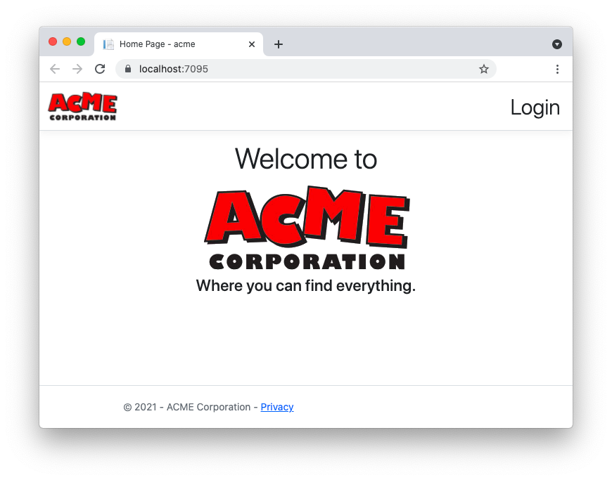

This repository contains two projects:

- An ASP.NET Core MVC application integrated with Auth0 authentication in the `catalog` folder.
- An ASP.NET Core Web API protected with Auth0 in the `redemption-api` folder.

Check out the article [Call Protected APIs in ASP.NET Core](https://auth0.com/blog/call-protected-api-in-aspnet-core/) for the implementation details.

# Requirements

- [.NET 6 SDK](https://dotnet.microsoft.com/download/dotnet/6.0) installed on your machine
- Visual Studio 2022 (optional)

# To run this application

1. Clone the repo with the following command:

   ```bash
   git clone https://github.com/auth0-blog/call-protected-api-aspnet-core.git
   ```

2. Move to the `redemption-api` folder.

3. Add your Auth0 domain and API identifier to the `appsettings.json` configuration file (see [Configure the API](https://auth0.com/blog/call-protected-api-in-aspnet-core/#Configure-the-API) for more details). Take note of the API identifier.

4. Type `dotnet run` in a terminal window to launch the API.

5. Move to the `catalog` folder.

6. Add your Auth0 domain, client id, and client secret to the `appsettings.json` configuration file (see [Configure the catalog application](https://auth0.com/blog/call-protected-api-in-aspnet-core/#Configure-the-catalog-application) for more details). Also, Assign the API identifier value to the `Audience` key.
7. Type `dotnet run` in a new terminal window to launch the application.
8. Point your browser to the [https://localhost:7095](https://localhost:7095) address. You should see a web page like the following:


